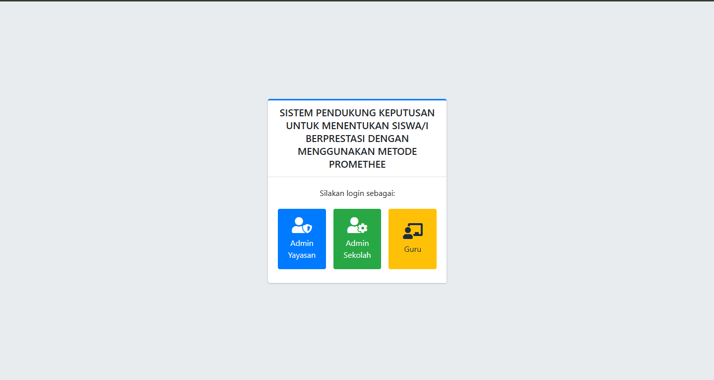
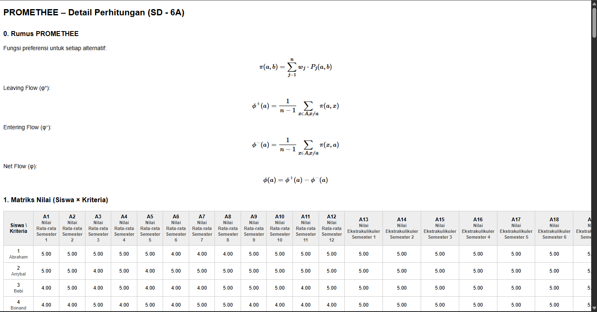
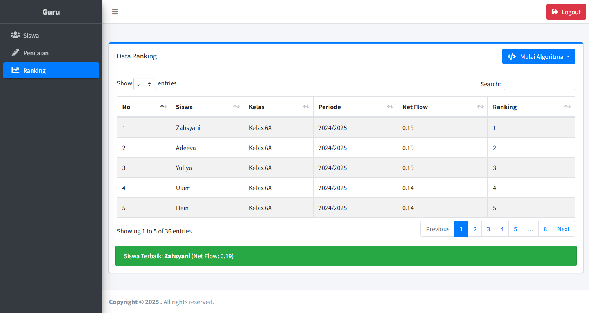
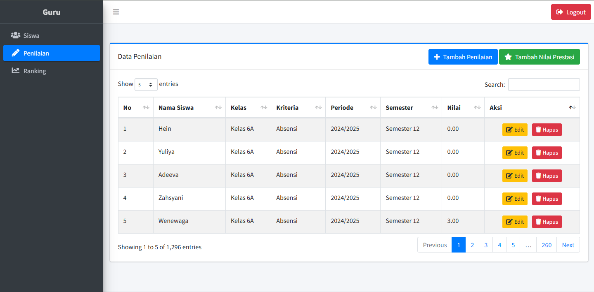

# SISTEM PENDUKUNG KEPUTUSAN UNTUK MENENTUKAN SISWA/I BERPRESTASI DENGAN MENGGUNAKAN METODE PROMETHEE

**Aplikasi berbasis Laravel 12 untuk membantu proses pengambilan keputusan dalam menentukan siswa berprestasi menggunakan metode _PROMETHEE_ (Preference Ranking Organization Method for Enrichment Evaluation).**

---

## 📌 Deskripsi Singkat

Sistem ini melakukan pemeringkatan siswa berdasarkan data nilai dan kehadiran untuk menghasilkan keputusan yang objektif dalam menentukan siswa/i berprestasi dengan pendekatan analisis multi-kriteria berbasis metode PROMETHEE.

### 📥 Kriteria Penilaian:

-   **Nilai Rata-rata per Semester**
-   **Nilai Ekstrakurikuler**
-   **Absensi**
-   **Prestasi**

### 🎯 Tujuan:

Menentukan **ranking siswa** berdasarkan perhitungan **Net Flow tertinggi** menggunakan metode PROMETHEE.

---

## 🖥️ Tampilan Aplikasi

### Halaman Login



### Halaman Perhitungan



### Halaman Hasil Ranking



### Halaman Penilaian



## ⚙️ Persyaratan Sistem

-   PHP 8.x ke atas
-   Composer
-   MySQL
-   Ekstensi PHP:
    -   PDO
    -   Mbstring
    -   Tokenizer
    -   XML
    -   Fileinfo
    -   Zip

---

## 🚀 Cara Instalasi & Menjalankan Proyek

1. **Clone repository:**

    ```bash
    git clone https://github.com/masmutdevofficial/spk-siswa-berprestasi-promethee
    cd spk-siswa-berprestasi-promethee
    ```

2. **Copy file `.env.example` dan ubah menjadi `.env`**

    ```bash
    cp .env.example .env
    ```

3. **Atur konfigurasi database di file .env**

4. **Generate application key:**

    ```bash
    php artisan key:generate
    ```

5. **Link storage (wajib):**

    ```bash
    php artisan storage:link
    ```

6. **Buat folder dengan nama seeders `storage/app/seeders`:**

    ```bash
    mkdir -p storage/app/seeders
    ```

7. **Salin file berikut ke folder `storage/app/seeders`:**

    - `penilaian-sd.xlsx`
    - `penilaian-smp.xlsx`
    - `penilaian-sma.xlsx`

8. **Jalankan migrasi dan seeder awal:**

    ```bash
    php artisan migrate
    php artisan db:seed
    ```

9. **Untuk memasukkan data penilaian lengkap dari file Excel:**

    ```bash
    php artisan db:seed --class=DataPenilaian
    ```

10. **Jalankan server lokal:**

    ```bash
    php artisan serve
    ```

11. **Akses melalui browser:**

    ```
    http://127.0.0.1:8000
    ```

---

## 👥 Akun Login Default

| Role            | Email                   | Password      |
| --------------- | ----------------------- | ------------- |
| Admin Sekolah 1 | adminsekolah1@gmail.com | adminsekolah1 |
| Admin Sekolah 2 | adminsekolah2@gmail.com | adminsekolah2 |
| Admin Sekolah 3 | adminsekolah3@gmail.com | adminsekolah3 |
| Guru 1          | guru1@gmail.com         | guru1         |
| Guru 2          | guru2@gmail.com         | guru2         |
| Guru 3          | guru3@gmail.com         | guru3         |
| Admin Yayasan 1 | adminyayasan1@gmail.com | adminyayasan1 |
| Admin Yayasan 2 | adminyayasan2@gmail.com | adminyayasan2 |
| Admin Yayasan 3 | adminyayasan3@gmail.com | adminyayasan3 |

---

## 📊 Output Sistem

-   Perhitungan lengkap PROMETHEE
-   Net Flow positif dan negatif
-   Ranking akhir siswa
-   Laporan cetak per sekolah dan yayasan

---

## 🔍 Keywords SEO

```
SPK Siswa Berprestasi, PROMETHEE Laravel, Sistem Pendukung Keputusan Sekolah, Penilaian Prestasi Siswa, Rekomendasi Siswa Terbaik, Net Flow Siswa
```

---

## 📌 Credits

This project is developed and maintained by [Masmut Dev](https://masmutdev.com), a Fullstack Developer from Indonesia. Dedicated to building efficient educational decision systems with clean logic and practical UI/UX.

© 2025 [Masmut Dev](https://masmutdev.com) – All Rights Reserved.
Lisensi: MIT
